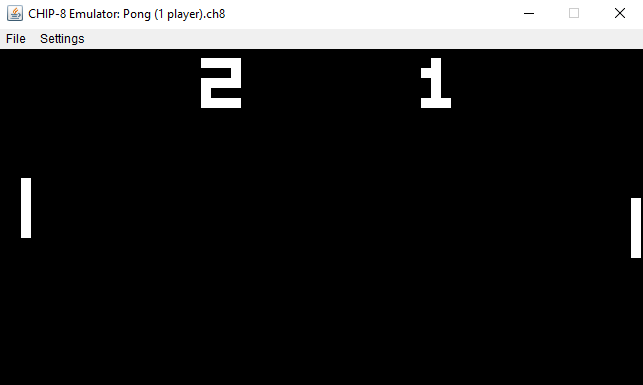
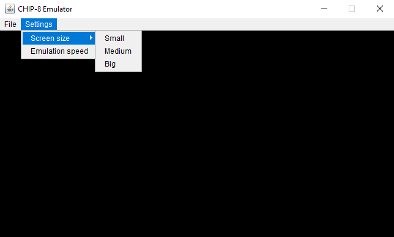
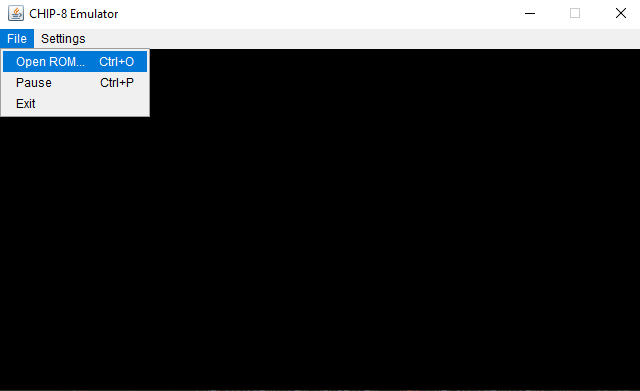

# CHIP-8 Java Emulator
CHIP-8 emulator written in Java. The main goal of this project was to better understand how CPU and memory works. 
Also emulators are super cool and I always wanted to write one. Note for future: Java is not the best language for this
type of projects (lack of unsigned types is one but not the only problem).

# Overview


Example of classic pong game played on emulator.



In settings menu you can choose screen size and emulation speed.



In file menu you can load ROM or pause emulation

# Key mapping

```
 Original keypad               Mapped keys
╔═══╦═══╦═══╦═══╗           ╔═══╦═══╦═══╦═══╗
║ 1 ║ 2 ║ 3 ║ C ║           ║ 1 ║ 2 ║ 3 ║ 4 ║
╠═══╬═══╬═══╬═══╣           ╠═══╬═══╬═══╬═══╣
║ 4 ║ 5 ║ 6 ║ D ║           ║ Q ║ W ║ E ║ R ║
╠═══╬═══╬═══╬═══╣     =>    ╠═══╬═══╬═══╬═══╣ 
║ 7 ║ 8 ║ 9 ║ E ║           ║ A ║ S ║ D ║ F ║
╠═══╬═══╬═══╬═══╣           ╠═══╬═══╬═══╬═══╣
║ A ║ 0 ║ B ║ F ║           ║ Z ║ X ║ C ║ V ║
╚═══╩═══╩═══╩═══╝           ╚═══╩═══╩═══╩═══╝
```
